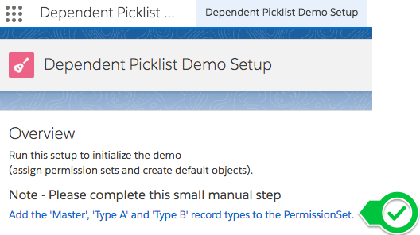

# Overview

We have two ways of filtering picklist options:

**Controlling/Dependent Picklists**

This is where the selection of one picklist (the controlling picklist) - specifies the options available for the controlled picklist.

For the purpose of this discussion, all options for the following picklist are disabled if 'No Level X' is chosen (otherwise all options remain available)

**RecordType Picklist Options**

Record Types also can filter Picklist options - to only those available for that Record Type.

For the purpose of this discussion:

* Master - sees only Valid or Not Valid
* Type A - sees Valid, Not Valid and Type A
* Type B - sees Valid, Not Valid and Type B

-----

What we want is to have both of these filters applied on top of one another,
so only options that are available (based on the controlling field and RecordType are shown)

.

# Record Edit Demo

The [recommended workaround](https://success.salesforce.com/issues_view?id=a1p3A0000008gNBQAY) at the moment is to leverage [force:recordEdit](https://developer.salesforce.com/docs/atlas.en-us.lightning.meta/lightning/aura_compref_force_recordEdit.htm?search_text=force:recordEdit) components to provide dependent picklists (based on record types)

This provides dependent picklists that work with record types using the standard page layout - edit screens for that record.

# How

* Create a `force:recordEdit` component
  * Specify the record id
  * Specify a controller handler for `onSaveSuccess`
  * ex:  `<force:recordEdit aura:id="edit-form" `   ` recordId="{!v.recordId}"`   ` onSaveSuccess="{!c.handleSaveSuccess}"`   ` />`
* Create a button to initiate the save
  * `<lightning:button label="Save" onclick="{!c.handleSave}" />`
* Create a component controller
  * To handle the button click / start the save
      * `handleSave : function(component){`   ` component.find("edit-form").get("e.recordSave").fire();`   `}`
  * To handle the save completion
      * `handleSaveSuccess : function(component){`   `$A.get('e.force:refreshView').fire();`   `$A.get('e.force:closeQuickAction').fire();`   `}`

**Note: this only specifies the record - and uses the current user's page layout.**

---

# Install

There are three methods available for you to install this demo, so you can play around with it:

(Please note, all are intended as demonstrations and are not intended for deployment to Production as is)

* [Install via URL](#install-via-url)
* [Install Demo via Salesforce CLI](#install-via-salesforce-cli)
* [Install Demo via Ant/Metadata API](#install-via-metadata-api)

## Install via URL

This works very similar to an App Exchange install.

Please login to an available sandbox and click the link below.

[https://test.salesforce.com/packaging/installPackage.apexp?p0=04t6A000002srkXQAQ](https://test.salesforce.com/packaging/installPackage.apexp?p0=04t6A000002srkXQAQ)

(or simply navigate to `https://YOUR_SALESFORCE_INSTANCE/packaging/installPackage.apexp?p0=04t6A000002srkXQAQ`  
if you are already logged in)

It is recommended to install for Admins Only (but all options will work)

##### Run Demo Setup

Next, click on the 'dice' and open the 'URL Hack Demo' app.

and run `Setup` from the `URL Hack Demo Setup` tab.

This will then perform any additional setup (such as creating records, etc).

##### Run the Demos

Thats it, all information should be avaiable for running all demos now from the `URL Hack Bases` tab.

Feel free to create your own and to create children through the QuickActions, Lightning Actions or List View buttons.

#### -- Known Issue -- Add the missing permissions on the permission set

If you get an error saying 'This record is not available' (when creating records),
you are likely affectd by a known issue with Unlocked Package deploys.

(This is also mentioned from the Setup page)

We are working with different teams, but it appears as though the installation works correctly from Salesforce CLI, but requires additional steps from the insllation URL.

**We appologize for this inconvenience and are working towards correcting it**

**1.** Navigate to the 'Dependent Picklist Demo' app

**2.** Navigate to the 'Dependent Picklist Demo Setup' page

and click on the link **Add the 'Master', 'Type A' and 'Type B' record types to the permission set'**

This will navigate you to the permission set in your org.

**3.** Click edit and enable the record types for that permission set.

## Installing via the Salesforce CLI

This assumes you have already installed the [Salesforce CLI]() and [Connected the Salesforce CLI to your org](https://developer.salesforce.com/docs/atlas.en-us.sfdx_dev.meta/sfdx_dev/sfdx_dev_auth_web_flow.htm).

However, the Salesforce CLI can be used with any org and does not require Salesforce DX to be enabled. (Although enabling the DX / Dev Hub would give some great benefits, and would only require care of [certain object permissions: Scratch Org Info, ActiveScratchOrg, NamespaceRegistry](https://developer.salesforce.com/docs/atlas.en-us.sfdx_setup.meta/sfdx_setup/sfdx_setup_add_users.htm) - as they are not available in all orgs)

**1.** Run the following command:

	sfdx force:mdapi:deploy -d mdapi -u [[orgAlias]] -w

**2.** Add the permission set to your user

	sfdx force:user:permset:assign -n DependentPicklistDemoParticipant -u [[orgAlias]]
	
**3.** Upload the data

	sfdx force:data:tree:import -f data/tree/ltng_DependentPicklistBase__c.json -u [[orgAlias]]
	
...

Thats it, you can now open the org, and find the 'ticket' object in the 'all tabs' search.

	sfdx force:org:open -u [[orgAlias]]

	
